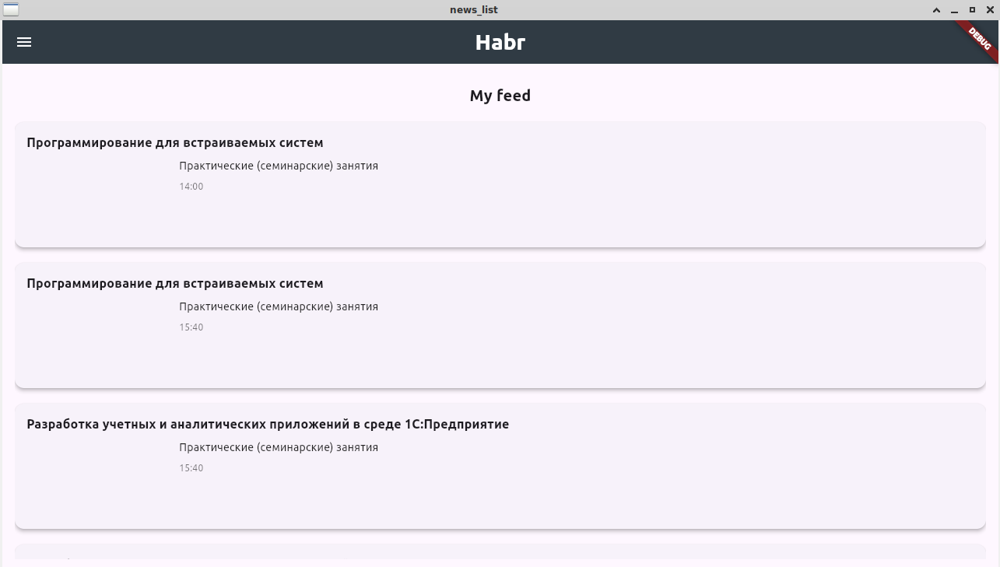
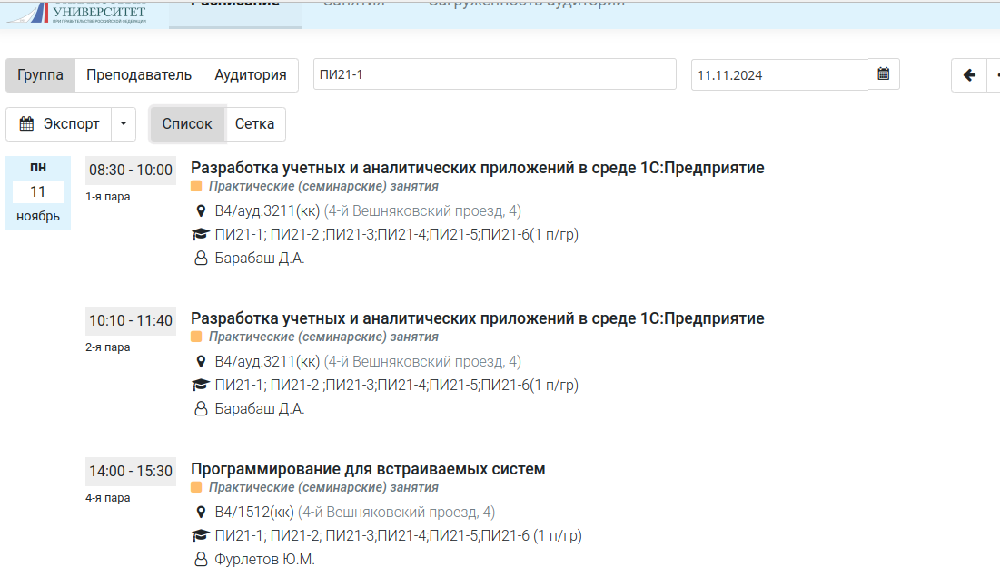

# news_list список занятий группы

## Roadmap

Чтобы приступить к этому уроку, нужно предварительно изучить по очереди:


- 2.flutter/statefull/statefull
- 2.flutter/flutter_calendar_view
- 2.flutter/provider
- 2.flutter/netbloc/netbloc


## Методичка

Рассмотрите этот пример, и обратите внимание, что объект наследуется от StatelessWidget

    class Post extends StatelessWidget

в 2.flutter/news_list/lib/post.dart

Попробуйте сделать из него вот это 

 

по типу



Для этого надо добавить знакомую вам функцию 

```dart

 Future<void> _fetchData() async {
    final response = await http.get(
      Uri.parse('https://ruz.fa.ru/api/schedule/group/137269?start=2024.11.18&finish=2024.11.24'),
    );

     if (response.statusCode == 200) {
    final List<dynamic> jsonResponse = json.decode(response.body);
    items = List<Post>.from(
          jsonResponse.map<Post>((dynamic e) => Post.fromJson(e))); 

  } else {
    String jsonString = await rootBundle.loadString('assets/andropov.json');
    List<dynamic> jsonResponse = json.decode(jsonString);
    items = List<Post>.from(
          jsonResponse.map<Post>((dynamic e) => Post.fromJson(e))); 
  }
    setState(() {
      items = items;   
      });
  }
```

и добавить к объекту Post

```dart
   factory Post.fromJson(Map<String, dynamic> json) { 
      return Post(
        title: (json['discipline'] as String?) ?? '',
        text: (json['kindOfWork'] as String?) ?? '',
        image: (json['lecturer'] as String?) ?? '',
        imageUrl: (json['parentschedule'] as String?) ?? '',
        url: (json['author'] as String?) ?? '',
        date: (json['beginLesson'] as String?) ?? '',
        // date: DateFormat('y.MM.dd').parse(json['date']) as String,// Переваем в строку
        // onImageTap: (((DateFormat('H:mm').parse(json['beginLesson']).hour)/2.4+(DateFormat('H:mm').parse(json['beginLesson']).minute)/60)*1.6).toString,
    );
  }
```